###Android SDK

# Obtaining Google Credentials for Sending Push Notifications to Android Devices Using Respoke

## Introduction

The process for generating credentials for use with Respoke push notifications is outlined in this guide. For more
information about sending push notifications with Respoke, see the [Push Notifications](/portal/push-notifications.html)
section of the Dev Portal guide.

In the [Google Developer Console](https://console.developers.google.com):

**Step 1.** Create or select a project in the Google Developer's Console. With a project selected, select the Overview
tab on the left. The Project Number will be your mobile app's Sender ID.  You'll embed the Sender ID into your app to
generate push tokens.

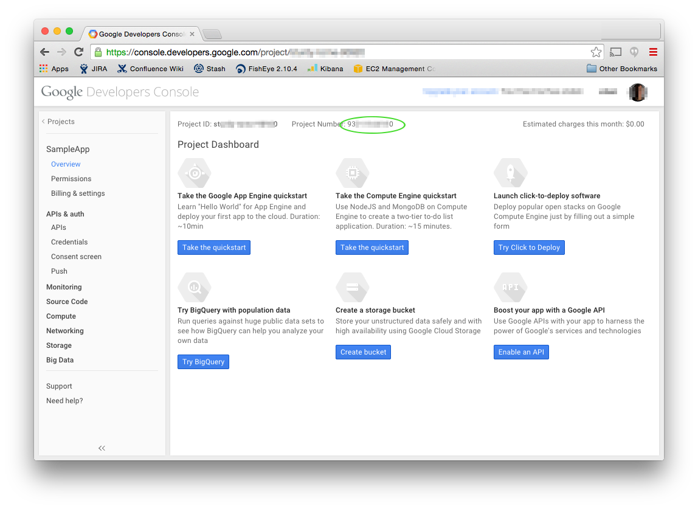

**Step 2.** Under APIs and Auth (left hand side of console), select APIs. From here select Cloud Messaging for Android.

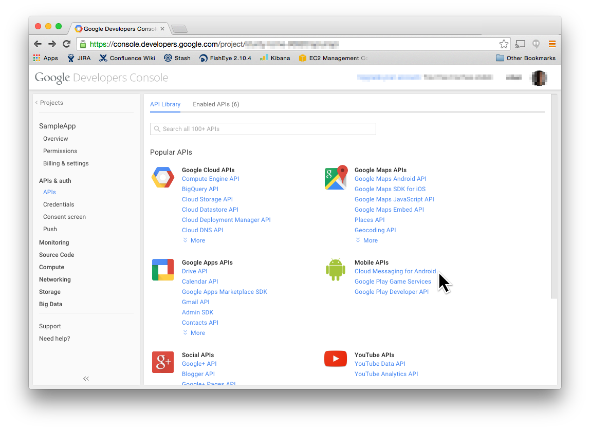

**Step 3.** Select Enable API to allow your app to use Google Cloud Messaging.

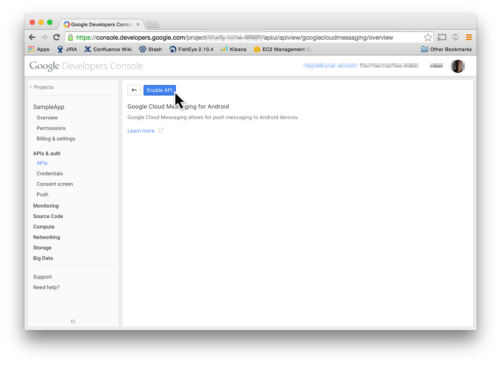

**Step 4.** To allow Respoke to send push notifications to your application, select the Credentials section on the left
side of the console, then select "Create new Key" under Public API access.

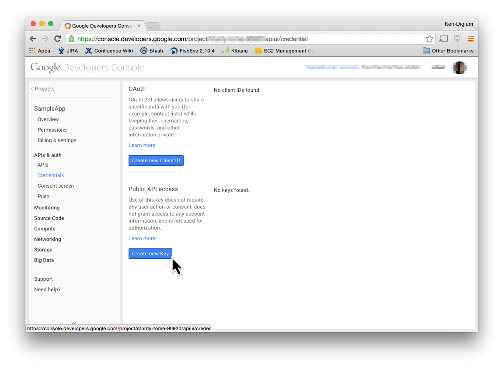

**Step 5.** From the choices presented, choose "Server key".

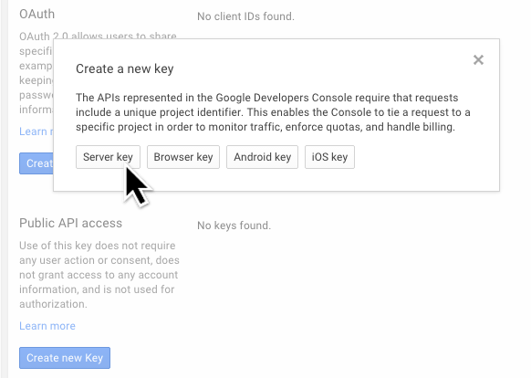

**Step 6.** Enter the IP address **54.152.227.206** in the text field. This will allow Respoke server's to push messages
to your mobile app. You can add your own servers on other lines if you send other push messages directly from your own
server, or you can leave this field blank altogether to accept push notifications from any IP address. The latter is not
recommended.

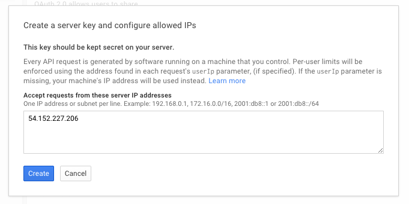

**Step 7.** Make note of your API Key. You'll need to provide this in the Respoke portal, and you'll also need it to
link your mobile app to this project.

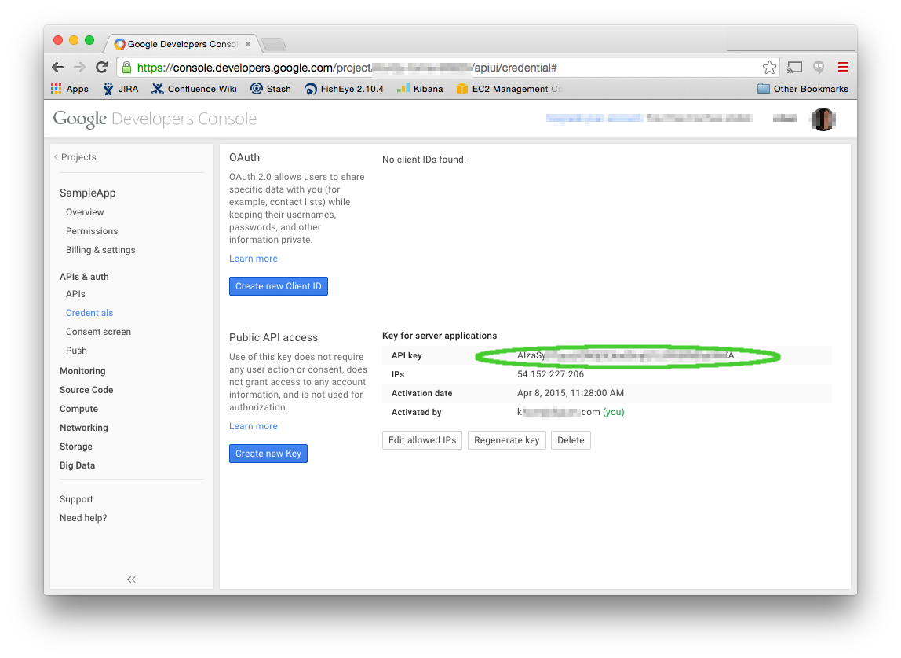

**Step 8.** Log in to the [Google Play Store](https://play.google.com/store). For your app, select "Services and APIs"
on the left side. Then select the "Link sender ID" button.

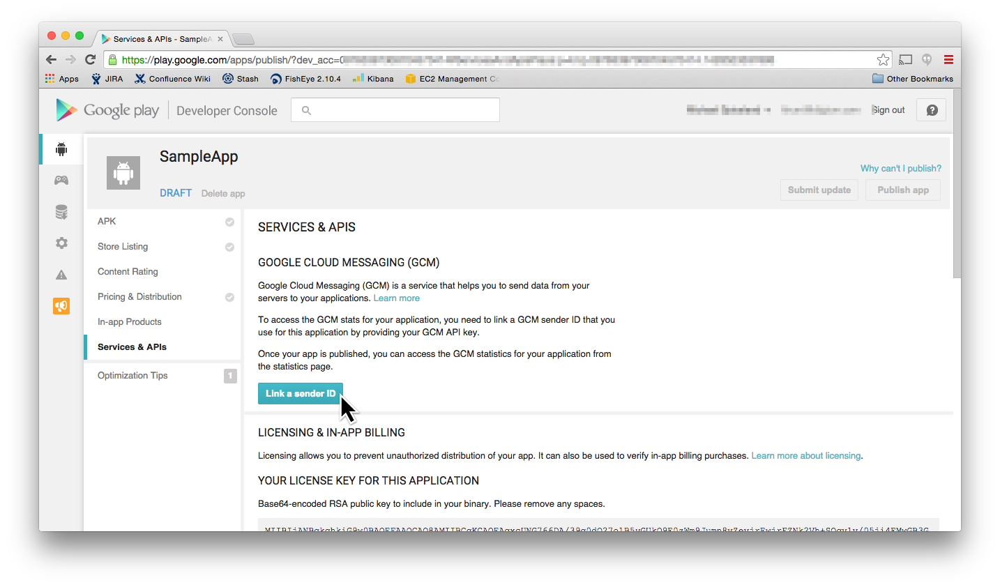

**Step 9.** Paste in the API key you generated in Step 7. Select Link.

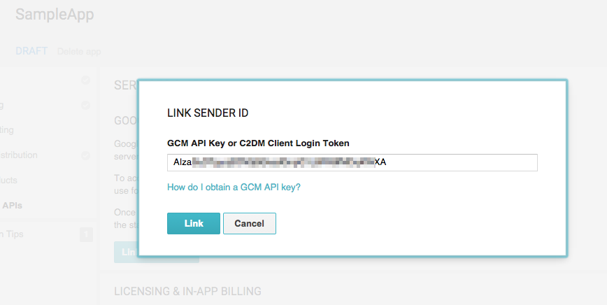

**Step 10.** The console will fetch the Sender ID from the Developer Console Project and you'll see it listed under
Linked Sender IDs.

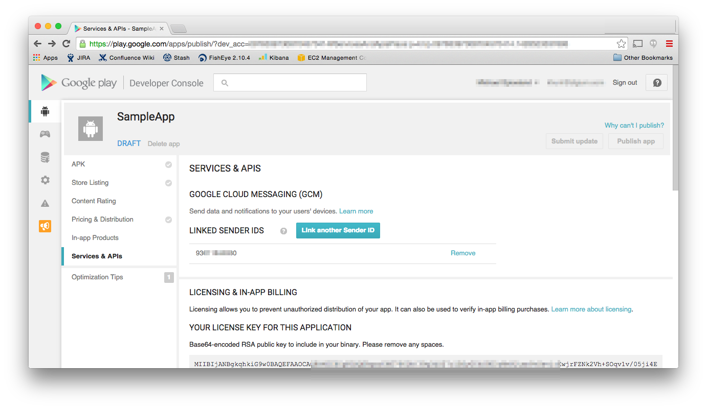

**Step 11.** Paste the API Key you generated in Step 7 in the Respoke portal.

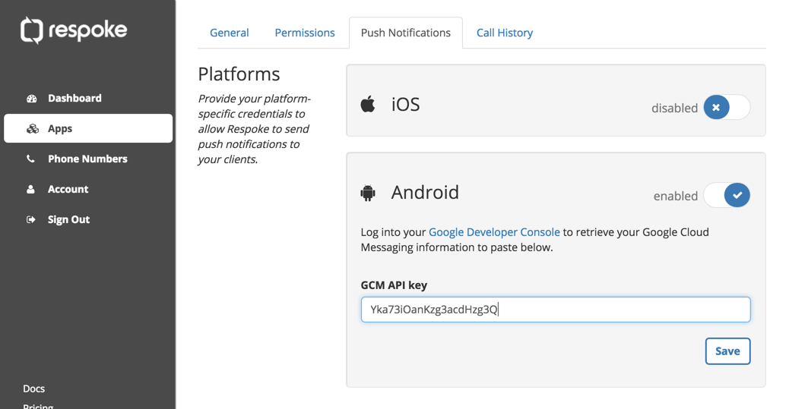
