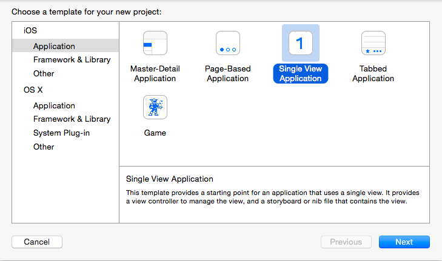

###iOS SDK
# Getting Started

## Create an account

First [signup for a free Respoke account](https://portal.respoke.io/#/signup). Within the Respoke Dashboard you can create, manage and delete Respoke Apps. Clicking on a specific App lets you view your App ID, App Secret, whether you have Dev Mode enabled and App Roles (if any).

## Setup Xcode IDE

### Create an iOS Workspace

Open Xcode and create a new workspace. Now create a new project, select a single view application, supply the project options, and add the project to the workspace.

### Add the Respoke iOS SDK

To use the Respoke iOS SDK, you have two options.

First, clone the source from GitHub.
    
    git clone https://github.com/respoke/respoke-ios-sdk
    
Finally, install from CocoaPods
 
    pod install respoke-ios-sdk

## Connect to Respoke

Open your application's MainActivity.java class and add the code below to connect to the Respoke service. 

Connecting is performed by instantiating a RespokeClient instance. This class is one of the primary ways you will interface with Respoke and allows you to connect, disconnect, join groups, and more. 

Your application can also be notified of major client-level events by registering as a ClientRespoke.Listener. We will use the onConnect() listener to know when the application has finished connecting to the Respoke service.

    #import "Respoke.h"
    #import "RespokeCall.h"
    #import "RespokeClient.h"
    #import "RespokeConnection.h"
    #import "RespokeDirectConnection.h"
    #import "RespokeEndpoint.h"
    #import "RespokeGroup.h"

    public class Main implements RespokeClient.Listener, RespokeGroup.Listener, RespokeEndpoint.Listener {
        public RespokeClient client;

        public Main() {
            // Create an instance of the Respoke client
            client = Respoke.sharedInstance().createClient(this);
            client.setListener(this);        

            // App ID from the Respoke Dashboard for your App
            String appId = "c10a2075-3f3d-466f-82f9-d2285e64c5d4";  

            // The unique username identifying the user
            String endpointId = "spock@enterprise.com";

            // Execute some signin event, then connect to Respoke with
            client.connect(endpointId, appId, true, null, this.getApplicationContext(), new RespokeClient.ConnectCompletionListener() {
                @Override
                public void onError(String errorMessage) {
                    Log.d("MainActivity", errorMessage);
                }
            });   
        }

        // RespokeClientListener methods
        // "connect" event fired after successful connection to Respoke
        public void onConnect(RespokeClient client) {
            Log.d("MainActivity", "Connected to Respoke!");
        }
    }

Run your application, you should see it successfully connect to Respoke by looking at the LogCat output of your device/emulator:

    02-23 19:14:59.560  10584-10584/com.digium.respokedemo D/MainActivity﹕ Connected to Respoke!

