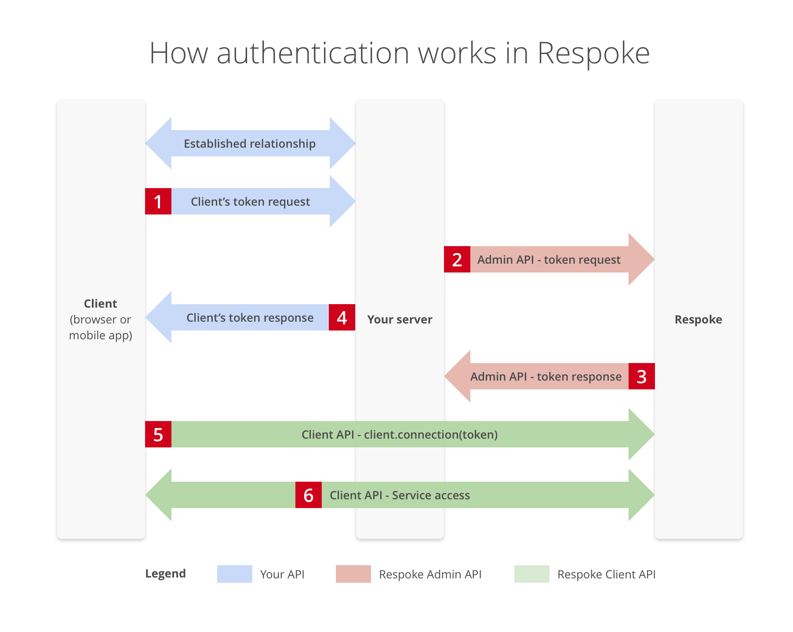

# Authentication

## In this article
* understand how you can control access to Respoke in your application
* learn about *development mode*
* get an overview of the back-and-forth authentication process of obtaining a token

## What is brokered authentication?

Your users need an access token to connect to Respoke.

The access token provides both authentication of **who they are** and authorization of **what
they are allowed to do**. When you use the Admin API to create a token for a user, you specify
these things. The exception is that when your app is in *development mode*, endpoints can
directly create access tokens without verification. They don't need you to request a token
for them - they can do it themselves.

*Development mode* makes getting started easy, but is inherently insecure. In production, you need
a server to verify users and [request a token on their behalf using the Admin API's endpoint authentication](/api/authenticating.html#endpoint-authentication). This gives you fine-grained
control over users and permissions.

## How do I get a token for one of my end users?

When you request a token, you need to provide:
* an endpoint name - `endpointId` - usually their username in your app
* a set of permissions - `roleId` - you create this in the
[Respoke developer console](https://portal.respoke.io) under an application
* how long it is valid - `ttl` - the number of seconds to let this endpoint be authenticated to
Respoke.

In the simplest case, you could provide us an endpoint name and request all permissions. Once
you receive a token, you provide this back in response to your user's original request. They use
the token (actually, the `tokenId`) to request the authentication access token you created for them.

## How authentication works in Respoke

## Step-by-step guide to brokered authentication in Respoke

### Assumptions

You already have a relationship with your end users to manage usernames, passwords,
and permissions.

### 1. Client's Token Request

Your user makes a request to your server, asking for a Respoke token.

### 2. Admin API - Token Request

When your server receives the request for a token, it makes a token request to Respoke, adding the **App Secret Key** as a header, a time-to-live (ttl) in seconds to ensure tokens can't be used very much later, and a named identifer also known as an "endpoint id". This can be a random string but is often a username for simplicity. The `endpointId` is how the user will be known by Respoke, when they connect with the provided token response. You'll also provide the id of a role representing a set of permissions that Respoke will use to allow or protect certain actions attempted by this endpoint. Roles can be created in your [Dev Console](https://portal.respoke.io/), and there is more information about working with roles in the [roles tutorial](/tutorials/roles-and-permissions.html).

<pre><code class="xml">POST https://api.respoke.io/v1/tokens
Content-Type: application/json
App-Secret: 28B061B9-A0D4-4E52-A0ED-EB6EA125F82A
</code></pre>

    {
        "appId": "34A9DDB9-D4AO-52AA-0ADE-EABEA521F2BA",
        "endpointId": "bobsmith",
        "roleId": "96070A0D-32B1-4B8C-9353-FE3E6A5E6C1D",
        "ttl": 86400
    }

### 3. Admin API - Token Response

    {
        "tokenId": "7C5F4410-35A1-41AC-B8DE-295AF375B7D9",
        "appId": "28B061B9-A0D4-4E52-A0ED-EB6EA125F82A",
        "endpointId": "bobsmith",
        "roleId": "96070A0D-32B1-4B8C-9353-FE3E6A5E6C1D",
        "createTime": 1395254788,
        "expiryTime": 1395341188
    }

### 4. Client's Token Response

Your API responds to the user request in step 1. The only thing you need to return is the `tokenId`.

**Important note:** For security, the `tokenId` will only live for a few seconds. The `ttl` is applied
to the session `token` after your user requests it with the `tokenId`.

### 5. Client API - `client.connect()`

**JS Client Library Method**

The client application now uses the [Respoke JS library](/js-library/respoke.html) to connect to Respoke using the token.

    client = respoke.createClient();

    client.connect({
        reconnect: false, // disable automatic reconnection when not in development mode
        token: tokenId
        // callbacks go here
    }); // or chain promises here

### 6. A note about automatic reconnection

A new token is required on every connection. Because of this, when using brokered auth you'll need to listen to the `disconnect` event and fetch a new token. Then use this new token to reconnect.

    client.listen('disconnect', function () {
        // trigger your code which fetches a token from your server
        getNewToken(function onSuccess(token) {
            client.connect({
                token: token
            });
        });
    });

 

**REST API Method**

When using REST directly, you'll need an application session token which you can get from the following API request. This token can be used to access the API directly by passing it with the request in an `App-Token` header. This happens automatically when using Respoke.js, the JavaScript client library.

#### Request

<pre><code class="xml">POST https://api.respoke.io/v1/session-tokens
</code></pre>

    {
        "appId": "D76D3B0A-35A1-41AC-A42D-FCE662BD1D96",
        "tokenId": "D5E3723F-5753-4FEC-AE1C-FCD805C157C6"
    }

#### Response

    {
        "message": "Authorization successful",
        "token": "F9B2F271-0D25-43CE-A910-DBBF4A54FE6F"
    }

Use the `token` string from the request as the value for the `App-Token` header for subsequent [REST API](/reference/rest-api.html) requests.

### 7. Service Access

This is where you use the Respoke Client API for service access (sending messages, placing audio/video calls, and setting up datachannels for transferring data).

**JS Client Library Method**

    endpoint.call();

 

**REST API Method**

Example: TURN access

One of the things that you can now do with the Client API (now that your client is a logged in endpoint) is to request TURN server credentials.  Below is an example of this.

#### Request
<pre><code class="xml">POST https://api.respoke.io/v1/turn
App-Token:F9B2F271-0D25-43CE-A910-DBBF4A54FE6F</code></pre>

    { } // no body needed

#### Response

    {
        "username": "3B35E769-A0E8-4B63-9881-35544EE0A158DC2654BD-170A-4D42-93A2-4E0EB4C560EB.1395342047",
        "password": "Gk4TtCYgGGcmheBXWFnnlm0kMVU=",
        "ttl": 86400,
        "uris": [
            "turn:exampleturnurl.respoke.io:3478?transport=udp"
        ]
    }
